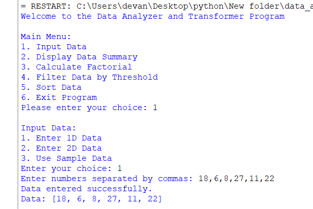
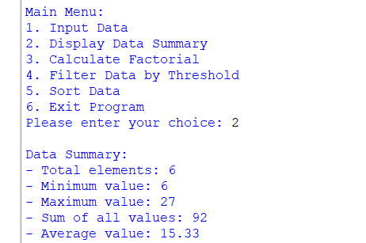
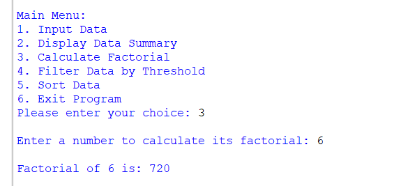
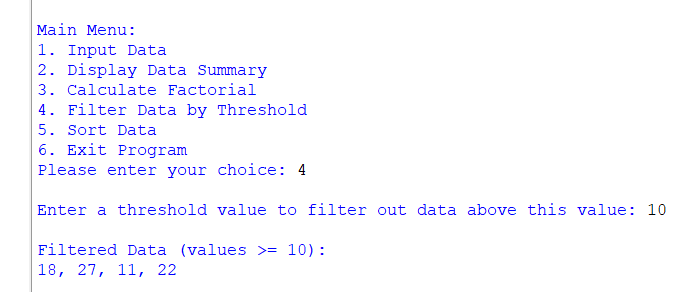
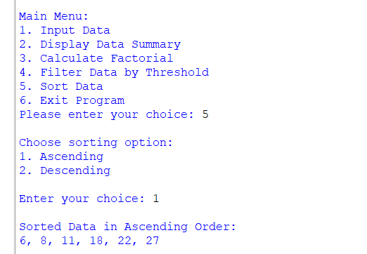
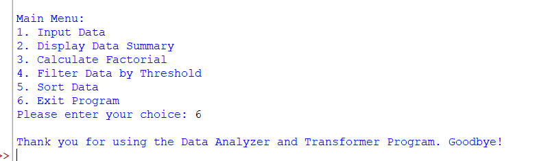

# Data Analyzer and Transformer

## Project Overview

The **Data Analyzer and Transformer** is a simple menu-driven Python program developed to demonstrate basic Python programming concepts used for data analysis and transformation.

The program allows the user to enter data, view data summaries, calculate factorials, filter data using a threshold, sort data, and display dataset statistics.

The project focuses on simple and practical implementation of Python concepts such as built-in functions, user-defined functions, recursion, lambda functions, lists, sorting, multiple return values, `*args`, `**kwargs`, and global variables.

---

## Objectives

The main objectives of this project are:

- To create a menu-driven Python application.
- To accept and process numerical data.
- To use Python built-in functions for data analysis.
- To demonstrate user-defined functions.
- To demonstrate `*args` and `**kwargs`.
- To implement recursion using factorial.
- To use lambda functions with `filter()` and `map()`.
- To demonstrate 1D and 2D lists.
- To sort data using `sort()` and `sorted()`.
- To return multiple values from a function.
- To perform basic data filtering and transformation.

---

## Technologies Used

- **Programming Language:** Python
- **IDE:** Visual Studio Code
- **Version Control:** GitHub

## Main Menu

The program provides the following options:

Welcome to the Data Analyzer and Transformer Program

Main Menu:
1. Input Data
2. Display Data Summary (Built-in Functions)
3. Calculate Factorial (Recursion)
4. Filter Data by Threshold (Lambda Function)
5. Sort Data
6. Display Dataset Statistics (Return Multiple Values)
7. Exit Program

## Features
1. Input Data

   The user can enter:

   1D numerical data
   2D list data
   Sample data

2. Display Data Summary

   This option calculates and displays:

   Total number of elements
   Minimum value
   Maximum value
   Sum of all values
   Average value

3. Calculate Factorial

   The factorial option uses recursion to calculate the factorial of a number.

4. Filter Data by Threshold

   The program uses a lambda function with filter() to display values greater than or equal to the entered threshold.

5. Sort Data

   The program provides two sorting options:

   1. Ascending
   2. Descending

   Both sort() and sorted() are demonstrated.

6. Display Dataset Statistics

   This option uses a user-defined function that returns multiple values.

   The program displays:

   Minimum
   Maximum
   Sum
   Average

# 🧠 Python Concepts Demonstrated

This project demonstrates the following important Python concepts:

### 1. Built-in Functions

The project uses Python built-in functions for data analysis:

- `len()` – Counts the total number of elements.
- `sum()` – Calculates the sum of all values.
- `min()` – Finds the minimum value.
- `max()` – Finds the maximum value.

### 2. User-Defined Functions

Different functions are created to perform specific tasks such as:

- Inputting data
- Displaying the data summary
- Calculating factorial
- Filtering data
- Sorting data
- Displaying statistics

### 3. `*args`

The `*args` concept is used to allow a function to accept multiple values as arguments.

### 4. **kwargs

The **kwargs concept is used to pass multiple keyword arguments to a function.

### 5. __doc__

Docstrings are used in the project to provide descriptions of functions.

### 6. Recursion

Recursion is demonstrated through the factorial calculation.

The factorial function calls itself until the base condition is reached.

### 7. Lambda Function

A lambda function is used to filter data according to a threshold.

### 8. filter()

The filter() function is used together with the lambda function to select values that satisfy a condition.

### 9. map()

The map() function is used to convert the filtered numerical values into strings for displaying the result.

### 10. Global Variable

A global variable is used to store the dataset so that it can be accessed and modified by different functions.

### 11. Multiple Return Values

The project demonstrates how a function can return multiple values.

The statistics function returns:

Minimum value
Maximum value
Sum
Average

### 12. 1D List

A one-dimensional list is used to store numerical data.

### 13. 2D List

A two-dimensional list is used to represent data in rows and columns.

### 14. sort()

The sort() method is used to sort a copy of the dataset in ascending order.

### 15. sorted()

The sorted() function is used to create a sorted version of the dataset.

### 16. Data Filtering and Transformation

The project performs basic data transformation by:

Filtering values according to a threshold.
Sorting values in ascending or descending order.
Converting a 2D list into a 1D list for analysis.
Calculating statistical information from the dataset.

# 📸 Screenshots

The following screenshots show the different features and outputs of the Data Analyzer and Transformer program.

## Input Data

---

## Data Summary

---

## Factorial Calculation

---

## Filter Data by Threshold

---

## Sorting Data

---

## Exit Program

## Explanation Video

The project explanation video demonstrates:

## Conclusion

The Data Analyzer and Transformer project demonstrates how basic Python programming concepts can be combined to create a simple menu-driven data analysis application.

The project provides practical implementation of functions, lists, recursion, lambda functions, filtering, sorting, built-in functions, and other important Python concepts.
